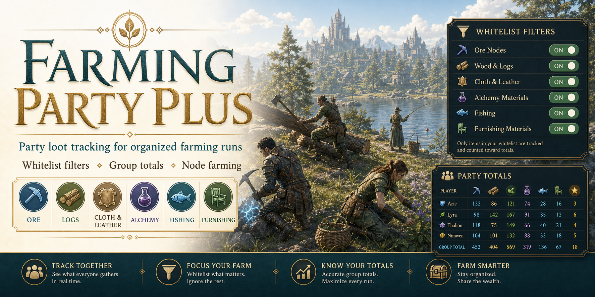

# Farming Party Plus

`Farming Party Plus` is an Elder Scrolls Online addon for tracking party farming loot with a cleaner focus on node runs, material filtering, and host-side event tracking.

It is designed for players who want to run organized farming groups without cluttering the totals with junk gear, white trash drops, or low-priority materials.

## What It Does

- Tracks loot for you and your group from one host client
- Supports a material whitelist for node farming
- Lets you toggle exactly which materials count
- Shows tracked loot in a scoreboard window and item breakdown window
- Logs loot to chat and the loot window
- Can send and receive its own built-in fishing/gutting sync when `LibGroupBroadcast` is installed
- Supports fishing-session gutting flows, including processed fish subtraction and `Fish` / `Perfect Roe` outputs
- Shows explicit `Stack Found` history lines when a later catch causes an already-held common-fish stack to be claimed into the session total
- Supports saved whitelist profiles and recipe value filtering

## Main Features

### Node Farming Whitelist

Whitelist mode is the core feature of `Farming Party Plus`.

Instead of tracking loot only by item quality, you can choose exactly what counts. This is useful for:

- ore runs
- wood runs
- cloth runs
- jewelry dust runs
- alchemy mat runs
- enchanting rune runs
- provisioning ingredient runs
- furnishing mat runs
- fishing runs

When whitelist mode is enabled, only the items you turn on will count.

### Category-Based Filtering

The whitelist window groups items into clear sections so it is easy to build a custom farm profile:

- `Ore`
- `Logs`
- `Cloth & Leather`
- `Jewelry Dust`
- `Alchemy`
- `Enchanting`
- `Provisioning`
- `Fishing`
- `Furnishing Mats`

Each category supports:

- individual item toggles
- `All On`
- `All Off`

The `Logs` category matches the raw wood materials you actually loot from nodes, such as `Rough Maple` and `Rough Ruby Ash`, instead of the refined crafting materials.

### Saved Whitelist Profiles

Whitelist setups can be saved account-wide as reusable profiles.

This is useful if you switch between different group money runs such as:

- fishing events
- ore routes
- furnishing mat runs
- recipe-focused node routes

Profiles can be:

- named
- saved
- loaded from any character
- deleted later if no longer needed

Main addon settings are also stored account-wide, so whitelist choices, profiles, and related configuration no longer drift between characters on the same account.

### Recipe Value Filtering

Whitelist mode also includes a `Recipes` rule.

When enabled, recipes are only tracked if they meet the configurable minimum value threshold. This keeps low-value recipes out of money-focused event totals while still allowing valuable recipes from nodes to count.

By default:

- recipe tracking is off
- the minimum recipe value starts at `3000g`

### Price Source Priority

`Farming Party Plus` can now prefer a specific market source when multiple pricing addons are available through `LibPrice`.

You can choose:

- `Auto`
- `TTC`
- `MM`
- `ATT`

Behavior:

- `Auto` uses `TTC -> MM -> ATT`
- if a selected market source is missing or has no data, it is skipped automatically
- vendor value is always the final fallback

This keeps totals stable even if a preferred market addon is not installed on a given client.

### Loot History Price Source Labels

If you want more detail in chat or in the loot history window, you can also turn on a setting to show where the displayed price came from.

When enabled, loot-history lines can append:

- `TTC`
- `MM`
- `ATT`
- `Vendor`

This only affects loot history display. It does not change scoreboard totals or item breakdown totals.

### Standard Tracking Mode

If whitelist mode is turned off, the addon falls back to the more traditional tracking model:

- minimum item quality
- gear on or off
- motifs on or off
- self loot on or off
- group loot on or off

While whitelist mode is enabled, `Minimum Item Quality` is not used and is disabled in the settings panel to avoid cross-character or cross-client confusion during whitelist-driven events.

### Fishing And Gutting Sessions

`Farming Party Plus` now supports fishing sessions more directly.

It can:

- count caught fish
- show when a previously held stack was folded into the session total
- subtract processed fish from the scoreboard
- count `Fish`
- count `Perfect Roe`
- warn when ESO `Auto-Add to Craft Bag` would interfere with tracked fishing outputs

This makes it better suited for guild fishing events where processed items are part of the total payout picture.

It also now supports stack-aware fishing sync recovery for other `FarmingPartyPlus` clients, so if another client resets and you later catch another fish into the same tracked stack, the receiver can rebuild the correct stack-backed total instead of only seeing the new `+1`.

For remote gutting outputs, `Fish` and `Perfect Roe` are resolved through stable local canonical links on the receiving client, so whitelist matching, pricing, and displayed price-source labels stay consistent across clients.

The member scoreboard also distinguishes live state more clearly during events:

- a green `H` marks the local `FarmingPartyPlus` host row
- helper-active members keep a `*`
- offline grouped characters gray out instead of looking fully active

## Installation

### Main Addon

Install this folder into your ESO addons directory:

- `FarmingPartyPlus`

Typical path:

- `Documents\Elder Scrolls Online\live\AddOns\FarmingPartyPlus`

### Required Libraries

`Farming Party Plus` expects these libraries:

- `LibAddonMenu-2.0`
- `LibAsync`
- `LibPrice`

### Fishing Sync Library

If you want multi-client fishing/gutting sync, install:

- `LibGroupBroadcast` `>=95`

`LibGroupBroadcast` is not required for normal `FarmingPartyPlus` use. It is only needed for the built-in fishing/gutting sync path:

- processed fish subtraction
- `Fish`
- `Perfect Roe`
- touched fish-stack replay after reset or late join
- blue trash fish that are easier to reconstruct locally than remotely

The built-in sync path now uses a single `LibGroupBroadcast` protocol owned by `FarmingPartyPlus`, rather than the older split helper flow.

## Commands

### Main Commands

| Command | Description |
| --- | --- |
| `/fpp` | Toggle the main member scoreboard window |
| `/fpp reset` | Reset all tracked loot data |
| `/fpp start` | Start tracking |
| `/fpp stop` | Stop tracking |
| `/fpp status` | Show current tracking state |
| `/fpp update` | Refresh party members |
| `/fpp filters` | Open the whitelist window |
| `/fpp loot` | Toggle the loot history window |
| `/fpp log` | Toggle the loot history window |
| `/fpp whitelist on` | Enable whitelist mode |
| `/fpp whitelist off` | Disable whitelist mode |
| `/fppc` | Output current scores to the chat input |
| `/fpphelp` | Print command help |
| `/fpploot` | Toggle the loot history window |
| `/fp` | Legacy alias for `/fpp` |
| `/fpc` | Legacy alias for `/fppc` |

## Recommended Use

### For a Farming Party Host

Use `FarmingPartyPlus` if you are the player running the event and want:

- the scoreboard
- the loot windows
- whitelist filtering
- chat output
- host-side tracking

### For a Simple One-Client Setup

You only need:

- `FarmingPartyPlus`

This is the standard setup.

### For Multi-Client Fishing/Gutting Sync

Use:

- `FarmingPartyPlus` on every participating client
- `LibGroupBroadcast` on every client that should contribute fishing/gutting sync

### Sync Indicators

The members window also shows whether your client has observed built-in fishing/gutting sync traffic from a party member.

This helps confirm that another `FarmingPartyPlus` client is actually talking to the host during event testing.

## Notes

- Saved variables update on `/reloadui`, logout, or exit
- Group loot tracking depends on what the ESO API exposes to the host client
- Some actions are easier to see locally than remotely, which is why the built-in fishing/gutting sync path exists
- Gear and motif filters still apply when whitelist mode is active
- Loot history can be shown or hidden independently of chat logging through the keybind or loot-window commands
- Fishing outputs can be affected by ESO `Auto-Add to Craft Bag`, so the addon warns when that setting would interfere with tracked fishing results

## Credits

Originally based on `Farming Party`, which was originally based on `Group Loot` by Temeez.

Pricing support is intended to work with libraries and tools commonly used by ESO trading addons.
